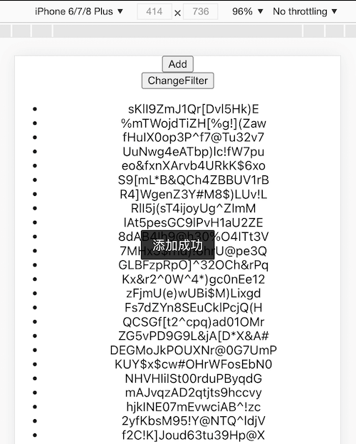

# Intro
Github 找了几页一个小小的 toast 组件都木有，全是基于 React 或者 Vue，就写个自己用吧。  
需求很简单，弹出提示，弹出加载提示（有遮罩），可以自动或手动移除掉，不需要外部依赖，目前加载后自动注册到 window 上。  
注：多次调用时会叠加显示，不会自动上下间隔分开

# Install
```
npm install @lilonghe/toast
```
```
import '@lilonghe/toast';
toast.show('Hello,World!');
```

# Methods

## config
全局配置  
```
toast.config({
    style: {},
    maskStyle: {},
    className: '',
    maskClassName: '',
    duration: 2000,
    targetElement: 'body',
});
```
## show
```
toast.show(text, [options]);
```

## loading
```
toast.loading([text=loading]);
```

### remove
```
let loading = toast.loading([text=loading]);
loading.remove();
```

# Preview
